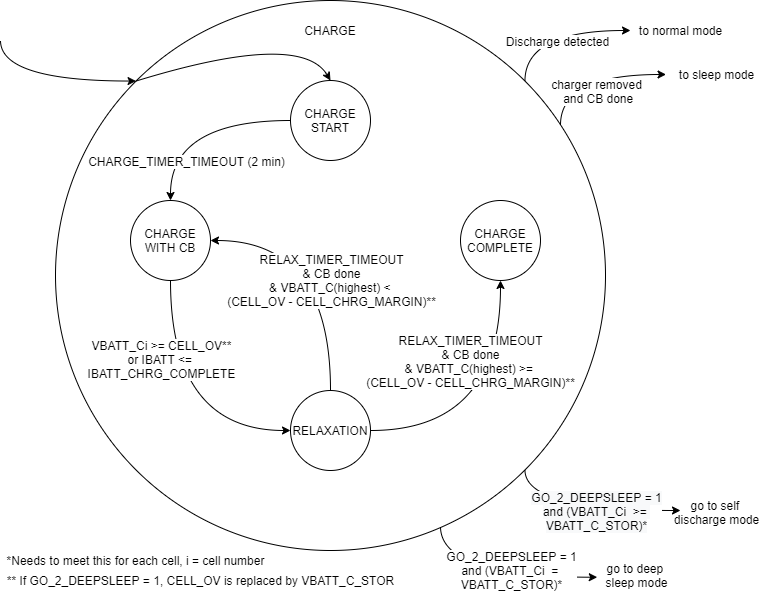

# BMS application state machine

## The main state machine

In Figure 2 the main state machine that will be implemented in the BMS application can be seen. This state diagram will be implemented in the BMS application. Below the state machine, in Main state machine explained, the explanation of the states can be found. These states are needed for the requirements and to make a structured way of programming possible.

## Main state machine explained

### **INIT state**

The INIT state is typically entered from the SLEEP state. In this state the micro controller unit \(MCU\) will wake up and it will verify configurations, fault registers and functions. This is needed because it can enter the INIT state when the user resets the fault in the FAULT state. When everything is OK, it will close the switches if not already closed and proceed to the next state depending on the current direction. The LED will blink green in this state.

### **NORMAL state**

This is the state were the battery operates how it should be, it is being discharged by the drone. Meaning that the power switches are closed. The LED will blink green in this state and indicate the state of charge with it. In this state the BMS performs the following tasks:

* Battery voltage, cell voltage and current is measured and calculated every measurement cycle.
* SoC and SoH are estimated every measurement cycle.
* The UAVCAN BMS battery status will be send over the UAVCAN bus every measurement cycle.
* The user can read the BMS status and parameters with NFC and the CLI. The user may change the state to SLEEP.
* A timer will monitor if the current is below the sleep current for more than the timeout time. If this happens, it will go to the SLEEP state.
* It will monitor if the current flows in the battery and if the current is more than the sleep current for more than the charge detect time, the state will change to the CHARGE state.
* If the current is less than the sleep current while the button is pressed for 5 seconds, it will transition to the SELF DISCHARGE state.

### **CHARGE state**

During this state the same functions as in the NORMAL state are implemented as well. The charging of the battery is done in different stages and should implement the charging state diagram, this diagram can be found in Figure 3. These are the states and the explanation:

* CHARGE START: in this state the charging will begin, and a timer will start. After a set time \(default two minutes\) the state will change to CHARGE WITH CB. The LED will be dark blue to indicate charging.
* CHARGE WITH CB: in this state the cell balancing \(CB\) function will be activated. This function does cell balancing based on the cell voltage, the difference of each cell voltage compared to the lowest cell voltage and the battery capacity. When the voltage of one of the cells reaches the cell over voltage level or the charging current is less than the charge complete current, it will go to the RELAXATION state. The LED will stay dark blue and will blink if cell balancing is active. Balancing is done if the cells that are balanced, are the same voltage as the lowest cell voltage.
* RELAXATION: in this state the power switches are set open, disconnecting the battery from the charger. The battery will relax for the specified relax time \(default five minutes\). During this relaxing, the cells can still be balanced since this happens with a low balancing current. At the end of the relaxation period, the system will check whether the balancing is done. If balancing is done and the highest cell voltage is lower than the cell over voltage minus the voltage margin, it will return to the CHARGE WITH CB state to continue charge process. If the highest cell is within this margin, the charging is complete, and it will go to the CHARGE COMPLETE state. The system will check if the charger is disconnected and the cell balancing is done, it will go to the SLEEP state. The LED will be dark blue. While balancing is active the LED will keep blinking.
* CHARGE COMPLETE: in this state, the charging is done. The power switches will remain open and if the charger is disconnected it will go to the SLEEP state. The LED will be light blue.

If at any time the current flows from the battery to the output and this current is higher than the sleep current, the BMS transitions to the NORMAL mode. If the go to deep sleep command has been given there are two options: If one cell voltage is less than the storage voltage it will complete charging until each cell has reached the storage voltage, after this is done the BMS will transition to the DEEP SLEEP state. The other option is that no cell voltage is less than the storage voltage, than the BMS will transition to the SELF DISCHARGE state.

### **SLEEP state**

The sleep state is typically entered when the current is too low for an amount of time. To preserve power if nothing happens, the MCU will be set to sleep mode and most of its peripherals will be off. The power switches will be closed to make sure the battery could be used and the AFE will be set to sleep mode but will perform cyclic measurements. If any threshold is met during a cyclic measurement, it will wake the MCU and the BMS will transition to the INIT state to check what to do. Periodically, the MCU will wake up to go to the OCV state to measure the OCV. The CAN communication is disabled, but the user can communicate with the BMS using NFC or the CLI, this will wake the MCU. When this happens the AFE will wake up as well to ensure real time information. In this state the LED will be off or blink yellow if there is NFC communication with the user.  
This state has not been implemented yet.

### **OCV state**

The OCV state will allow to record the latest OCV of the battery which may be useful in the SoC computation during next NORMAL phase. Cyclically the Battery will enter this mode when the Battery stays in the SLEEP state. The period the system will go from the SLEEP state to the OCV state will depend on the time since the battery has entered the SLEEP state in the first place, without going to another state except the OCV state. The time to enter the OCV state will gradually increase each time with 50% from the set begin time until the set end time is reached. If for example the set begin time is five minutes and the set end time is twenty-four hours, it will take fifteen times to have a period of is twenty-four hours. When entering this mode, the MCU will wake up the AFE and measure. The LED will blink green.  
This state has not been implemented yet.

### **FAULT state**

The FAULT state is entered when a critical fault that requires the battery switches to be opened has been detected \(Over-current, over-voltage, Cell over-temperature\). But only in extreme cases, otherwise drones would be falling out of the sky. Depending on the type of fault a defined timer is started. When the end of the programmable timer is reached, the state will change to SLEEP, the power switches will be turned on again. This state, the FAULT state, can be exited before the timeout event by the user manually forcing the battery to go to the INIT state via the reset fault command \(could be done with the NFC or CLI communication\) as well or by activating the push button. The LED will blink red.

### **SELF DISCHARGE state**

This state is used to discharge the cells to the cell storage voltage in order to improve its life duration, when storing the battery for long time. In this mode, the power switches are open, the MCU is on and the CB function is activated. When the storage voltage is reached for each cell or if cells have a lower voltage, it will transition to the DEEP SLEEP state. NFC and the CLI remain active and CAN communication is disabled. The LED will blink dark blue in this state. To exit this state and to go back to the INIT state, the button needs to be pressed. 

### **DEEP SLEEP state**

This state is used for transportation, storage and under voltage protection. In this state; the power switches are open, disconnecting the battery, all protections are turned off, there are no cyclic measurements done, the LED is off, and it will set everything to sleep to ensure the lowest power usage. Only the button can wake everything in this state. When the button is pressed it will transition to the INIT state.

