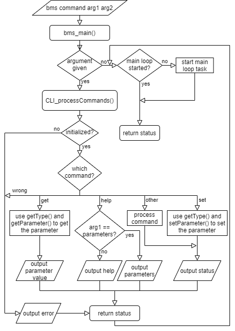
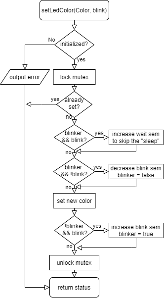
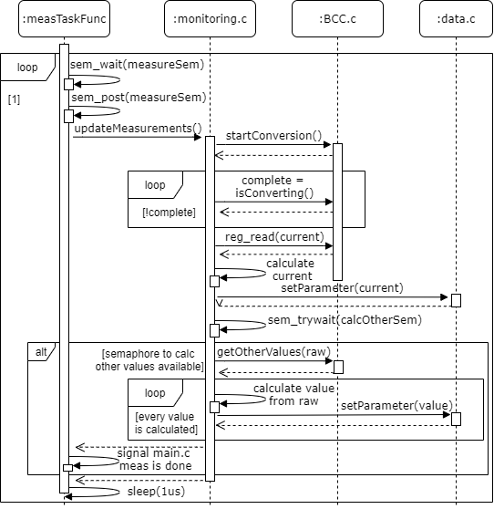
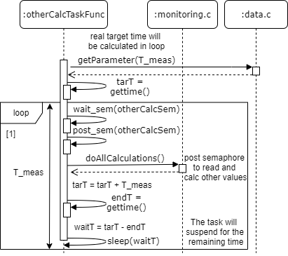
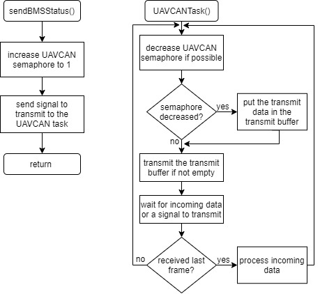

# Realization

### **Main**

In the main source file, the BMS main can be found, this is the BMS application. This function will initialize each part and start the main loop task. This task will implement the battery main state machine as seen in Figure 8. In the main source code, the state is changed. In this source file there is a function to handle a changed parameter as well. This function will call other functions from the needed parts to do something with the parameter that is changed. If for example a configuration changed, such that a configuration of the BCC needs to change, it will call the right function from the Bat management part to change the configuration of the BCC as well. In the main loop, the watchdog is kicked as well. So if this is not done in time, it will reset the MCU.

### **Data**

There is a lot of data that is needed or set by different tasks. Because it is not wise to move this big chunk of data through all the tasks there needs to be some sort of shared memory. Because NuttX is POSIX compliance there are shared memory functions that could be used. But for these shared memory functions a memory management unit (MMU) is needed and this microcontroller does not have an MMU. That is why the whole data management will be made in a data source file. This makes sure the data is only made once but is not global. With functions the data can be read or written, and these functions ensures protection against multiple threads accessing the data at the same time. These functions can be seen in Figure 5.

.png>)

To protect the data from multiple threads trying to access it at the same time, a mutex is used. A mutex is an object that can be locked and unlocked in an atomic operation. Meaning that if both threads want to lock the mutex, the threads cannot lock the same mutex at the same time. A mutex is needed to prevent data race. The other thread needs to wait until the mutex is available.

The big data chuck is in a struct, together with a parameter info array. This array supports a fast access of the data type, the minimum, the maximum and the address of the data. This ensures it is faster to get and set data than with a large switch.

If a variable is changed with the set parameter function, that function will set that variable and value in a global array. So, the task can access it. And it will increase a semaphore for the task to handle the change. This is done in a callback function to the main. This task is waiting for an available semaphore. A semaphore is an integer variable that can be increased and decreased in an atomic operation. It looks like a mutex because the thread will wait if the semaphore is not positive and tries to decrease it if positive.

### **CLI**

In NuttX there is a nuttshell, this is the UART communication with the MCU. In this nuttshell, applications can be called with and without arguments. There arguments will be given to the function it calls, in this case the BMS main. This means that a CLI can be created with calling the application with some arguments.

This CLI that is made, can be used by calling the BMS application in the nuttshell with a command and optionally 2 arguments for that command. When this happens the BMS main is called. Meaning that this main needs to be resistant against multiple calls, this should not restart the BMS application because than the battery power will be cut.

If there are commands given when calling the BMS application, the CLI process commands function will be called to handle it. It will parse the command and optionally the arguments and check if the inputs are valid. If it is valid, it will act based on which command has been given. The flowchart can be seen in Figure 6.

### **LED state**

In order to set a color to the RGB LED, the set led color function should be used. The flowchart of this function can be found in Figure 7. Because this function can be used from different tasks, a mutex will be locked before it checks if the color and if blink is already set. This function will set the semaphore to start or stop the blink sequence. It will skip the semaphore timed wait function to ensure the blink sequence restarts if needed. It will begin with the new color. This function will use the NuttX userled functions.

****

### **GPIO**

In order to use a GPIO in NuttX, these GPIO’s need to be defined in the board file and the board specific GPIO file. This will create devices for each GPIO pin. To use the GPIO in the application an IOCTL call needs to be used. IOCTL means input-output control and it is a device specific system call.

The IOCTL is used to give commands to a driver to control a device, in this case the GPIO pins. But for an IOCTL to work an open file descriptor needs to be given. This is obtained by giving the path to the device as a string. This is too much work to do in the application for setting or reading a GPIO, that is why a GPIO BMS application driver is made. This will make sure that a GPIO can be read or written with simple write/read pin functions and a define to indicate the pin. An input pin can be an interrupt pin, on an interrupt it will generate a signal that will queue the action for the handler. Keep in mind that these signals can be very intrusive.

### **Bat management**

The Bat management part can be used to monitor the battery and control the gate. Because the Bat management part is quite large there are other source files made to help with the BCC, to keep it organized. Like monitoring, to take care of measurements and configuration, to take care of the whole configuration for the BCC. For the main to implement the state machine, functions are made to let the main implement the functionality. Some functions are made to enable the measurements, to check for faults, to self-discharge etc.

The meas task is created to do the manual measurements with the BCC and calculate the variables. Because the BCC will not check for an overcurrent, the current needs to be read and calculated every time to be compared with the current threshold. For short circuit protection there is a hardware circuit. The rest of the measurements will only be read and calculated if a semaphore is available. An extra task called otherCalc task is created to increase this semaphore each time the other measurement data is required to be known. This is needed at period T\_meas. If the semaphore is increased, the meas task will decrease the semaphore, read the other registers and calculate battery voltage, battery current, cell voltages, the temperatures, remaining charge, the average power and set them. Then it will signal back to the main that the measurements are done. The sequence of the meas task can be seen in Figure 8. The sem\_wait and sem\_post functions are called consecutively in the endless loop, this is used to start and stop the task with a function from the main.

After the semaphore is increased, the otherCalc task will suspend for the remaining time. This can be seen in Figure 9. Gettime() returns the time from the start of the whole application. To make sure the cyclic measurements does not drift, the time before the loop starts and the period T\_meas are gained. The target time is calculated by adding the period with the previous target time. If T\_meas should change, this is updated in the sequence using a global variable. This is left out of the sequence diagram because it is too detailed. If the semaphore is increased, the end time is gained. The difference of the target time and the end time give the time that the task needs to sleep.

To calculate the state of charge, the coulomb counter is used. The coulomb counter register holds the sum of the measured currents (until read). There is another register that holds the number of samples in the coulomb counter register. The average current is calculated by dividing the sum of the currents by the number of samples. When the time is known for which the average current is calculated, the difference in charge can be calculated with the following formula: ∆Q=I\_avg\*∆t. The new remaining charge is calculated by adding the difference in charge with the old remaining charge. The state of charge can then be calculated by dividing the FCC by the remaining charge.&#x20;

In order to provide the average power consumption over a time period of ten seconds, a constant moving average is taken. This moving average is constructed by removing the oldest measurement and adding the new measurement, which is than divided by the amount of measurements. This way the average will only be of the last ten seconds. In order to be memory efficient, the measurements used in the moving average will be sub-sampled if the measurement period is configured as less than one second. This way maximum ten old measurements need to be known. Measurements are not lost when sub-sampling, because the BCC chip will remember an average of it
.

The BCC chip will take care of fault monitoring for the overvoltage, undervoltage, over temperature and under temperature. It will set the fault pin high when there is an error. If this happens it will trigger an interrupt in the main and it will check what fault happened. The main can than act on the fault. This ensures that the main is in control of what happens.&#x20;

Since the user can change configurations in run time, sometimes a configuration needs to be changed in the BCC as well. When there is a change in the configuration, this is set with the setParameter function and a task in the main source file will handle the change. This function will call a function to handle the change in the bat management part. In this part it will call the right function from the configuration source file to change the configuration of the BCC. &#x20;

Since the charging state machine and the main state machine is implemented in the main, but it needs information that is from the bat management part, a callback function will be used to give this information to the main if needed. This way the task to implement the state machine is not constant polling for information but will react if the information changes. This will ensure that this task is not always active, and the resources are used for other tasks
.

### **SBC**

The SBC part is used to control the power of voltage regulators V1 (The most used 3.3V) and V2 (CAN PHY). With the setSbcMode() function the mode of the SBC can be set. In the normal mode both V1 and V2 are active, in the standby mode V2 is off, turning off the CAN transceiver and in the sleep mode both V1 and V2 are off, turning off almost the whole BMS board. In Figure 10 the simplified flowchart of this function can be seen. Besides power regulators, the SBC has a watchdog, which is used to reset the MCU if it doesn’t kick the watchdog within the set time, this is done via the NRST pin.

.png>)

### **UAVCAN**

In the beginning of the project everything was designed towards UAVCAN V0. Later in the project it was clear that UAVCAN V0 will not work in NuttX. But there was a new version of the UAVCAN protocol, version one (V1). Within NXP, a solution has been made to make the UAVCAN V1 protocol in NuttX. In this new version, the battery info standard as stated in V0 was not specified. This is a problem since the BMS should eventually communicate over UAVCAN. And since more companies were interested in a battery info standard. A draft standard has been made. This standard has been proposed to a company that is working together with NXP and other companies to make UAVCAN V1 standards for drones. This standard is still being developed. Because the company would like to see an example working with UAVCAN, a snapshot of the draft protocol was taken, and this has been implemented with the BMS. This part works with a UAVCAN task that waits (it sleeps until a CAN transceiver signal comes in) for an incoming UAVCAN transmission or a signal from the main that new data needs to be send. When new data needs to be sent, it will put the data that needs to be sent in the transmit buffer. It will check if the transmit buffer if it is filled and transmit the data if it is. Then it will wait for an incoming transmission again. To see the flowchart see Figure 10. There is a UAVCAN V1 message set implemented. Which is a snapshot of the UAVCAN V1 with WIP DS-015. This consists of 3 messages, the energy source, the battery status and the battery parameters. These messages can be seen in Table 2,  Table 3 and Table 4. For more information about UAVCAN V1, see [sourceTs ](https://github.com/UAVCAN/public\_regulated\_data\_types/tree/master/reg/drone/physics/electricity)and the battery service.

Table 2: Energy source 0.1 UAVCAN V1

| Type    | Name                  | Unit | Description                                                                                                                                      |
| ------- | --------------------- | ---- | ------------------------------------------------------------------------------------------------------------------------------------------------ |
| Uint56  | timestamp.microsecond | us   | The number of microseconds that have passed since some arbitrary moment in the past. UNKNOWN = 0.Float32                                         |
| Float32 | source.power.current  | A    | Battery current.                                                                                                                                 |
| Float32 | source.power.voltage  | V    | Battery voltage.                                                                                                                                 |
| Float32 | source.energy         | J    | A pessimistic estimate of the amount of energy that can be reclaimed from the source in its current state.                                       |
| Float32 | source.full\_energy   | J    | A pessimistic estimate of the amount of energy that can be reclaimed from a fresh source (a fully charged battery) under the current conditions. |

Table 3: Battery status 0.2 UAVCAN V1

| Type            | Name                  | Unit | Description                                                                                                                                                                                                                                                   |
| --------------- | --------------------- | ---- | ------------------------------------------------------------------------------------------------------------------------------------------------------------------------------------------------------------------------------------------------------------- |
| Uint2           | heartbeat.readiness\* | -    | SLEEP = 0, STANDBY = 2, ENGAGED = 3.                                                                                                                                                                                                                          |
| Uint2           | heartbeat.health\*    | -    | SLEEP = 0, STANDBY = 2, ENGAGED = 3.                                                                                                                                                                                                                          |
| Float32\[2]     | temperature\_min\_max | K    | The minimum and maximum readings of the pack temperature sensors.                                                                                                                                                                                             |
| Float32         | available\_charge     | C    | The estimated electric charge currently stored in the battery.                                                                                                                                                                                                |
| Uint8           | error\*               | -    | Error status. NONE = 0, BAD\_BATTERY = 10, NEEDS\_SERVICE = 11, BMS\_ERROR = 20, CONFIGURATION = 30, OVERDISCHARGE = 50, OVERLOAD = 51, CELL\_OVERVOLTAGE  = 60, CELL\_UNDERVOLTAGE = 61, CELL\_COUNT = 62, TEMPERATURE\_HOT  = 100, TEMPERATURE\_COLD = 101. |
| Float16\[<=255] | cell\_voltages        | V    | The voltages of individual cells in the battery pack.                                                                                                                                                                                                         |

Table 4: Battery parameter 0.3 UAVCAN V1&#x20;

| Type    | Name                            | Unit | Description                                          |
| ------- | ------------------------------- | ---- | ---------------------------------------------------- |
| Uint64  | unique\_id                      | -    | Unique number.                                       |
| Float32 | mass                            | Kg   | The total mass of the battery.                       |
| Float32 | design\_capacity                | C    | Design capacity.                                     |
| Float32 | design\_cell\_voltage\_min\_max | V    | Factory cell voltages.                               |
| Float32 | discharge\_current              | A    | The discharge current.                               |
| Float32 | discharge\_current\_burst       | A    | The burst discharge current at least for 5 seconds.. |
| Float32 | charge\_current                 | A    | The charge current.                                  |
| Float32 | charge\_current\_fast           | A    | The fast charge current.                             |
| Float32 | charge\_termination\_treshold   | A    | End-of-charging current.                             |
| Float32 | charge\_voltage                 | V    | Total charging voltage.                              |
| Uint16  | cycle\_count                    | -    | The amount of cycles.                                |
| Uint16  | Void16                          | -    | Was cell count.                                      |
| Uint7   | state\_of\_health\_pct          | %    | The state of health.                                 |
| Uint8   | technology.value                | -    | Battery chemistry 110 = LiPo, 111 = LiFePO4.         |
| Float32 | nominal\_voltage                | V    | The nominal battery voltage.                         |

