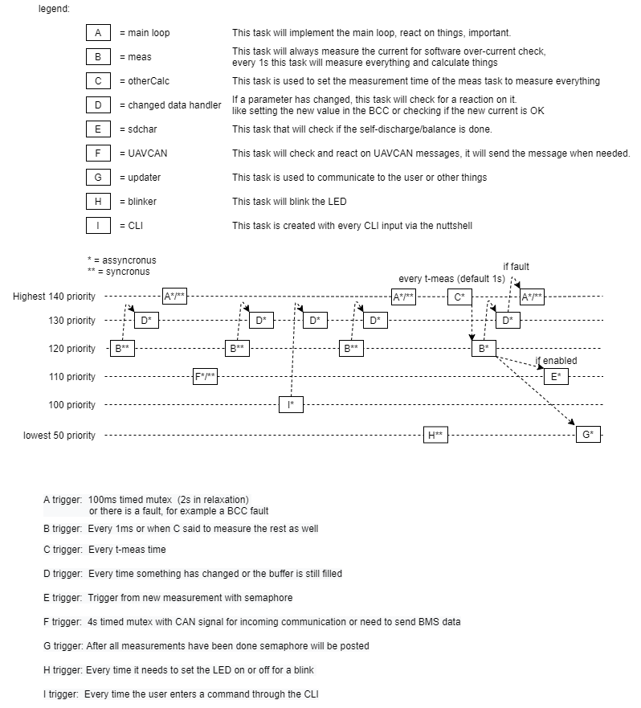

# Task priorities

The tasks of the BMS have different priorities, this is needed because some tasks/activities are more important than others. For example, one needs to react fast on a fault, so the system needs to prioritize a fault above blinking the LED. The BMS uses the NuttX preemption, which means that lower priority tasks get interrupted by a higher priority task. The task priorities can be seen in Figure 4.

When one of the BCC functions is called \(via the spiwrapper\), the task is locked so it can’t switch tasks. This way it makes sure it will execute the function OK, otherwise there could be CRC errors or NULL responses.

