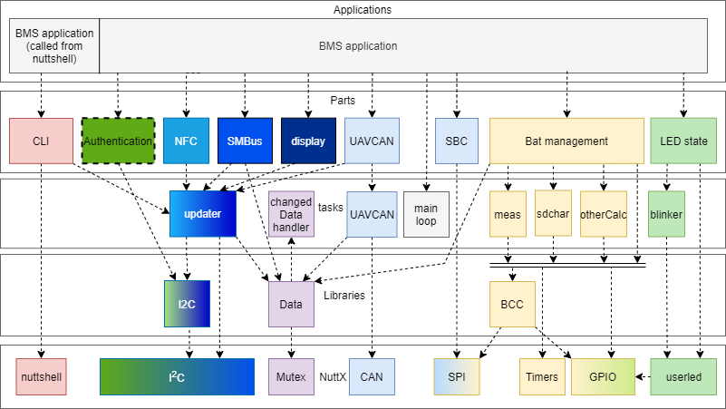

# Software block diagram

## Software block diagram

Figure 1 is the BMS application consisting of several modular parts. Functions from these parts can be called from the BMS application. These parts are tasks that will run semi-parallel (since it is still a single core processor). NuttX scheduler will take care of this aspect for us.&#x20;

The CLI (command line interface) module is called by running the BMS application from the nuttshell interface with arguments. An explanation of each of the blocks can be found below in the module description section. The CLI module is needed for easy debugging and user interface, while the NFC, Display, UAVCAN, SBC, Bat management and LED state modules are needed for the overall functional requirements.

## Module description

### **BMS application**

The BMS application creates the main task wich implements a battery state machine. It calls the functions from the different modules to implement the overall BMS application. This application is called during startup. The application can be called from the nuttshell with various arguments to use it as a CLI.

### **CLI**

The command line interface (CLI) module takes care of communication with the user through the NuttX nutshell, it can be used during debugging of the smart battery application or a specific battery under test. The communication is mapped to use a universal asynchronous receiver-transmitter (UART) also known as the root console. The CLI can output messages in colors if the ANSI escape sequences are enabled in the terminal.

The application command may be followed by optional arguments such as sleep, deepsleep, wake, reset, help, show, set or get. With the set or get command the user can read and write every value, including the configuration parameter list. These values can be read/written by calling the BMS application followed by a set or get command followed by the name of the variable. In the case of a set command this would instead be followed by the new value of the variable. Try the command “bms help” to see the help of the CLI

### **Authentication - A1007**

The authentication module will take care of the authentication using the A1007 chip. The A1007 is capable of secure asymmetric key exchange and storage as well as secure monotonic counters and flags for use in such things as counting charge or discharge cycles or permanently flagging under-voltage or over-temperature conditions.\
This module is not implemented yet. Only verification via I2C is implemented.

### **The NFC - NTAG5**

The NFC module manages NFC communication. It can be used to read all kind of parameters. It should be able to read the values with a refresh rate of once a second. The updater task will be used to update the data. It can operate in a similar manner to a double ported EEPROM, and NFC records can include standardized messages for HTTP or text records. In this way the NFC tag could be updated regularly with status information. That information could be added to text message, and a smartphone would be capable of reading the message with data attached with minimal coding effort. This method removes the need for any custom software on the reading device.

### SMBus&#x20;

SMBus is an alternative way to communicate information to the FMU. The BMS could be seen as an I2C slave device. Reading from specified registers returns the BMS data. Things like voltages, temperatures, state of charge, average current could all be read from these registers. The SMBus needs to be enabled with the variable in order to work.

### **Display**

The display module manages information presented on an optional local I2C LCD display (e.g. SSD1306 type). This module is not implemented yet.

### **UAVCAN**

The UAVCAN module manages UAVCAN communication. UAVCAN V1 protocol is used to relay battery and power usage to the FMU (or host processor). The UAVCAN legacy message V0 can be used as well. It sends the battery information on a cyclic time interval. It has a task named UAVCAN that will check if data is received and will send the data if needed. The CAN PHY is in the SBC (UJA1169).&#x20;

### SBC - UJA1169

The SBC module manages the power of the voltage regulators in the SBC. With this module the SBC can be set in normal mode, standby mode and sleep mode. In the normal mode both V1 (powers the MCU and more) and V2 (powers internal CAN PHY and 5V) are powered. In standby mode, V2 is off and in sleep mode both regulators V1 and V2 are off. The sleep mode is needed for the DEEP SLEEP state. The SBC provides a watchdog.

### **Bat management**

The Bat management (battery management) part is the most important part, it will oversee the whole battery management. It will be used to monitor the battery, the PCB (temperatures) and calculate voltages, temperatures, current, SoC, SoH, average power and more, it will ensure the BCC chip reacts if thresholds are exceeded. Function of this part can be used to drive the gate driver, which allows it to disconnect the battery from the output power connector on the BMS. Because this is such a large part of the system, the Bat management part can create some tasks. These tasks can all access the BCC, the timers and the GPIO. These are the tasks: These are the sub-tasks:

* **meas task** -  this task will oversee the measurements and if triggered do the calculations.&#x20;
* **otherCalc task** - this task will make sure that once every measurement cycle, the meas task will do the calculations.
* **sdchar task** - this task will oversee the self-discharging.

### **LED state**

The LED state module can be used to set the RGB LED. It can set a RGB color on or off and blink the LEDs at given intervals. If a LED needs to blink a blinker task will be created to ensure it blinks. This module is used to inform the user visually of various states and status. Table 1: LED states

This module implements the LED states given below

| State                        | LED state                                                                                                                            |
| ---------------------------- | ------------------------------------------------------------------------------------------------------------------------------------ |
| Self-test                    | Red                                                                                                                                  |
| Deep sleep                   | Off (after 1 second white LED on)                                                                                                    |
| Sleep                        | Off                                                                                                                                  |
| Wake-up                      | Green                                                                                                                                |
| Normal                       | 
Green blinking (with state indication)

1 blink 0-40%

2 blinks 40-60%

3 blinks 60-80%

4 blinks 80-100%
 |
| Fault                        | 
Red blinking (Output disconnected)

Red (Output connected)
                                                             |
| Charging                     | Blue                                                                                                                                 |
| Charging done                | Green                                                                                                                                |
| Balancing/self-discharge     | Blue blinking                                                                                                                        |
| Charger connected at startup | Red-blue blinking                                                                                                                    |

### **Data**

Since different parts need to use the same data, a data library is used to take care of this. This library will make sure it is protected against concurrent usage by multiple tasks.
