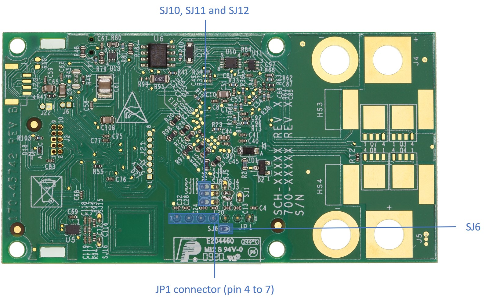
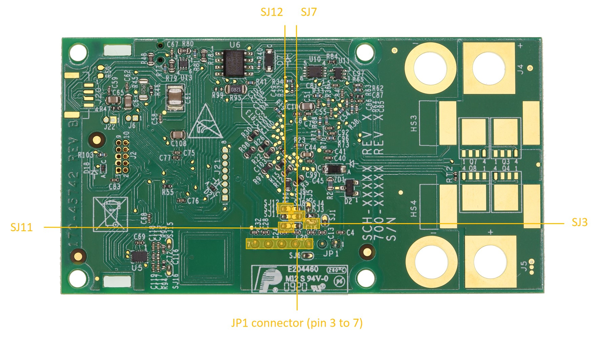
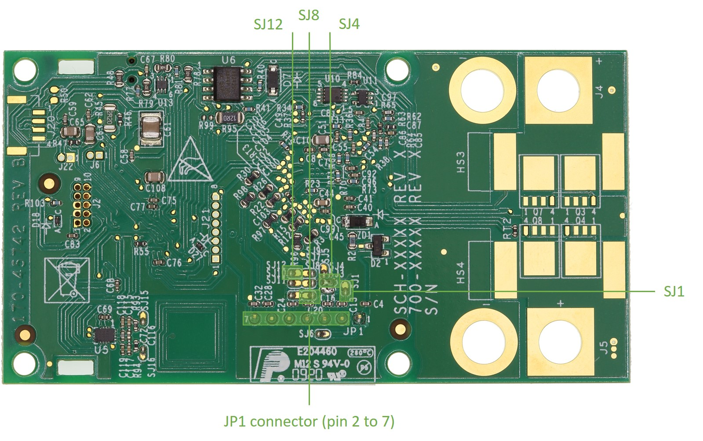
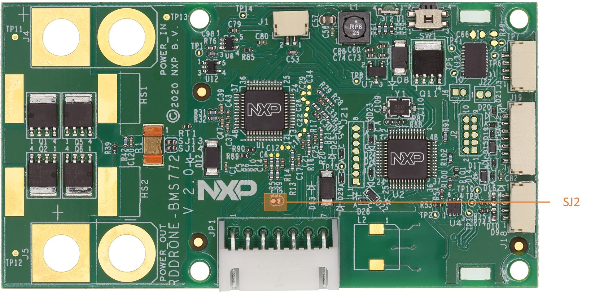
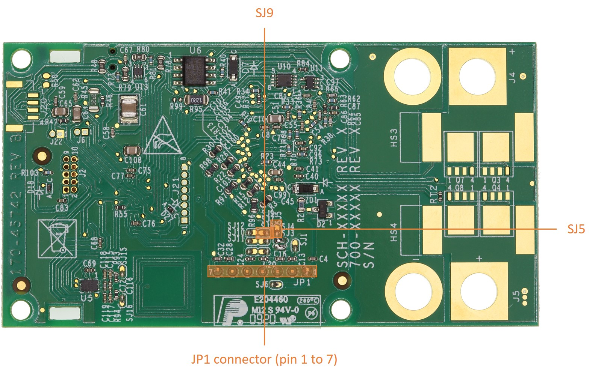

# Configuring the hardware

## Power connectors

Because the RDDRONE-BMS772 board aims to be adaptable for many different battery types, the power connectors are **not** mounted on the PCB. This allows the user to configure the board with the connectors they choose, or solder battery wires directly to the board. 


In a completed application, it is expected that the battery and BMS would be permanently attached. During development it can be prudent to allow disconnection of the battery for safety reasons.


The power connectors footprints on the design correspond to an XT90 hobby type connector such as the [DFRobot FIT0588](https://eu.mouser.com/ProductDetail/DFRobot/FIT0588?qs=w%2Fv1CP2dgqqgLwNcYqYWgQ%3D%3D) connector. These types of connectors are readily available at local and online hobby shops and may also be used for soldering typical silicone insulation heavy gauge power wires.   

TE connectivity has created a line of UMP \(Unmanned Power\) connectors specifically for professional high power mobile systems. Some kits ship with this type of connector included as a promotional item.


TE connectivity provides a line "UMP" connectors specifically for professional high power mobile systems.


## Cell terminal connection

The RDDRONE-BMS772 board is configurable to fit 3s to 6s battery packs. 


Solder jumpers must be soldered in place and the matching JP1 connector must be installed on the board to match your battery cell configuration. Do not operate the board without the correct configuration. 

This configuration must be done before using the board


The correct cell terminal connector should be soldered as JP1 on the top side. Connectors for 3s, 4s, and 6s are provided unsoldered in the kit.

* the connection to the cell terminal circuit should be done by soldering the correct solder jumpers as given in the table below. All jumpers are open by default

| Configuration | Jumpers connected | Associated JP1 connector | JP1 placement |
| :--- | :--- | :--- | :--- |
| 3s | SJ6, SJ10, SJ11 and SJ12 | S4B-XH-A\(LF\)\(SN\) | Pin 4 to 7 |
| 4s | SJ3, SJ7, SJ11 and SJ12 | S5B-XH-A\(LF\)\(SN\) | Pin 3 to 7 |
| 5s | SJ1, SJ4, SJ8 and SJ12 | S6B-XH-A\(LF\)\(SN\) | Pin 2 to 7 |
| 6s | SJ2, SJ5 and SJ9 | S7B-XH-A\(LF\)\(SN\) | Pin 1 to 7 |

_**Note**: SJ13, SJ14, SJ15 and SJ16 are not used for cell terminal connection. See_ [_Shunt resistor_](configuring-the-hardware.md#shunt-resistor) _and_ [_External NFC antenna_](configuring-the-hardware.md#external-nfc-antenna)_._

_**Note**: The other jumpers used for cell terminal connection \(SJ1 - SJ12\) should be open!_ 

_**Note**: The JP1 connector should be soldered on the top side of the board._

## Shunt resistor

The shunt resistor \(R1\) can be disconnected from the overcurrent protection circuit and the BCC by unsoldering the SJ13 and SJ14 jumpers. Both jumpers are closed by default.

## External NFC antenna

The on-board NTAG5 chip is designed to provide active antenna matching and amplification and will give enhanced performance when the battery is present and providing power. However, for extended range operation, the PCB antenna can be replaced by an SMD coil \(L2\). The coil is not mounted by default but the recommended part is SDR7045-2R2M. Also note that it is possible to solder wires and attach a remote NFC antenna to the same pads used for L2.

To use the SMD coil, the user must reconfigure the board using the following steps:

* remove both 0.75 Ω resistors R93 and R94
* solder close SJ15 and SJ16
* replace 82pF and 680pF capacitors C72 and C116 by a single 56pF capacitor

## Power MOSFETs and heatsinks

The RDDRONE-BMS772 board allows placement of four pairs of power MOSFETs \(PSMNR70-30YLH\) and four heatsinks \(FK 244 08 D2 PAK\). Half of them is on the top side of the board and the other half is on the bottom side. By default, only the two pairs of MOSFETs of the top side are mounted.

The user may want to place additional MOSFETs and/or optional heatsinks to their board. This allows to widen the maximum DC current limit as described in the following table:

| Configuration | Maximum DC current |
| :--- | :--- |
| 4 pairs of MOSFETs and 4 heatsinks | 90A |
| 2 pairs of MOSFETs and 2 heatsinks | 70A |
| 2 pairs of MOSFETs and no heatsink | 60A |

_**Note**: Exceeding the given current limit can permanently damage the board._

## Optional components

Depending on the application, the user may want to add some optional components onto the RDDRONE-BMS772 board.

External and additional components and their use are detailed in [External and additional components](../getting-to-know-the-hardware/board-components.md#external-and-additional-components).

