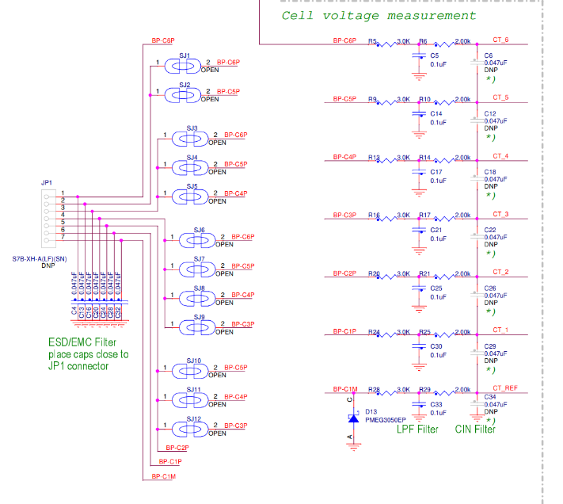

# Cell Terminal Connections

The following part of the schematic is copied here to assist users with wiring cell terminal connections based on custom battery packs.\
Typically hobby style LiPo Batteries are already wired correctly and will be plug and play.\
\
The key item to note is the JP1 pin 7 is the negative most CT on the battery pack. The next pin up JP1 Pin6 will be one cell voltage higher than JP7. \
\
Similarly Pin 5 will be one votage higher thatn Pin 6.\
This continues until the end of the cell count depending on how many cells you have configured the BMS for on the previous page,&#x20;

<figure><figcaption></figcaption></figure>
